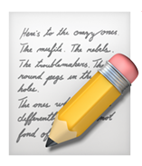
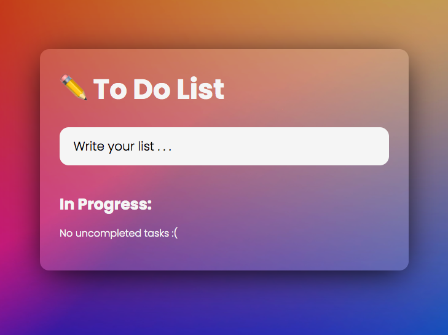

<!-- Improved compatibility of back to top link: See: https://github.com/othneildrew/Best-README-Template/pull/73 -->

<a name="readme-top"></a>

<!-- PROJECT SHIELDS -->
<!--
*** I'm using markdown "reference style" links for readability.
*** Reference links are enclosed in brackets [ ] instead of parentheses ( ).
*** See the bottom of this document for the declaration of the reference variables
*** for contributors-url, forks-url, etc. This is an optional, concise syntax you may use.
*** https://www.markdownguide.org/basic-syntax/#reference-style-links
-->

<!-- PROJECT LOGO -->
<br />
<div align="center">

<a href="https://github.com/arjunsarkar1/MyToDo"> </a>

<h2 align="center">To Do App</h2>

  <p align="center">
  A simple task management application designed to help any user stay organized and complete daily tasks. <br> </br>
    <a href="https://github.com/arjunsarkar1/MyToDo"><strong>Explore the docs »</strong></a>
    <br />
    <br />
    <a href="https://arjunsarkar1.github.io/MyToDo/">View Demo</a>
    ·
    <a href="https://github.com/arjunsarkar1/MyToDo/issues">Report Bug</a>
    ·
    <a href="https://github.com/arjunsarkar1/MyToDo/issues">Request Feature</a>
  </p>
</div>

<!-- TABLE OF CONTENTS -->
<details>
  <summary>Table of Contents</summary>
  <ol>
    <li>
      <a href="#about-the-project">About The Project</a>
      <ul>
        <li><a href="#built-with">Built With</a></li>
      </ul>
    </li>
    <li>
      <a href="#installation">Installation</a>
    </li>
    <li><a href="#usage">Usage</a></li>
    <li><a href="#contact">Contact</a></li>
  </ol>
</details>

<!-- ABOUT THE PROJECT -->

## About The Project



You can simply build, track, and manage your to-do list with its clear and user-friendly design.

<p align="right">(<a href="#readme-top">back to top</a>)</p>

## Built With

- **[HTML](https://developer.mozilla.org/en-US/docs/Web/HTML)** - Structure and layout
- **[CSS](https://developer.mozilla.org/en-US/docs/Web/CSS)** - Styling and design
- **[JavaScript](https://developer.mozilla.org/en-US/docs/Web/JavaScript)** - Logic and interactivity
- **[Font Awesome](https://fontawesome.com/)** - Icons
- **[GitHub](https://github.com/)** - Version control and collaboration
- **[VS Code](https://code.visualstudio.com/)** - Code editor
- **[Git](https://git-scm.com/)** - Version control system
- **[GitHub Pages](https://pages.github.com/)** - Hosting the web application

<p align="right">(<a href="#readme-top">back to top</a>)</p>

## Installation

1. Clone the repository on your local machine
   ```zsh
   git clone https://github.com/ArjunSarkar1/MyToDo.git
   ```
2. Open the `index.html` in your browser.

<p align="right">(<a href="#readme-top">back to top</a>)</p>

<!-- USAGE EXAMPLES -->

## Features

- ✨ **Modern Glassmorphism UI**: Beautiful, frosted-glass panels and cards for a clean, modern look.
- 📱 **Fully Responsive**: Works perfectly on desktop, tablet, and mobile.
- 📝 **To Do List**: Add, complete, delete, and filter tasks.
- 🏷️ **Priority Levels**: Tag tasks as High, Medium, or Low. Filter and sort by priority. All priority badges are visually consistent.
- 🔔 **Persistent Storage**: Your tasks are saved in your browser (localStorage).
- 🎉 **Confetti Animation**: Celebrate completed tasks with confetti from both corners.
- ⏳ **Pomodoro Timer**: Built-in Pomodoro system with start/pause/reset, session counter, and automatic session switching.
- 🎵 **Focus & Break Music**: White noise plays during Pomodoro, break music during breaks (auto-looping, seamless transitions).
- 🦾 **Accessibility**: Keyboard navigation, clear contrast, and screen reader-friendly.

<p align="right">(<a href="#readme-top">back to top</a>)</p>

## Usage

1. **Add a Task**: Type in the input and press Enter. Select a priority if desired.
2. **Complete a Task**: Check the box. Completed tasks move to the Completed section and trigger confetti.
3. **Delete a Task**: Click the X icon.
4. **Filter/Sort**: Use the dropdowns and sort button to organize your tasks by priority.
5. **Pomodoro Timer**: Use the timer above the To Do List. Start, pause, or reset. Music plays automatically for focus and breaks. Sessions continue automatically.
6. **Responsive**: Use on any device layout; always fit the screen.

_For more examples, please refer to the [Documentation](https://github.com/ArjunSarkar1/MyToDo.git)_

<p align="right">(<a href="#readme-top">back to top</a>)</p>

<!-- CONTACT -->

## Contact

Arjun Sarkar - arjunsarkar82@gmail.com

Project Link: [https://github.com/arjunsarkar1/MyToDo](https://github.com/arjunsarkar1/MyToDo)

<p align="right">(<a href="#readme-top">back to top</a>)</p>

<!-- MARKDOWN LINKS & IMAGES -->
<!-- https://www.markdownguide.org/basic-syntax/#reference-style-links -->

<!-- [product-screenshot]: images/productImg.png -->
